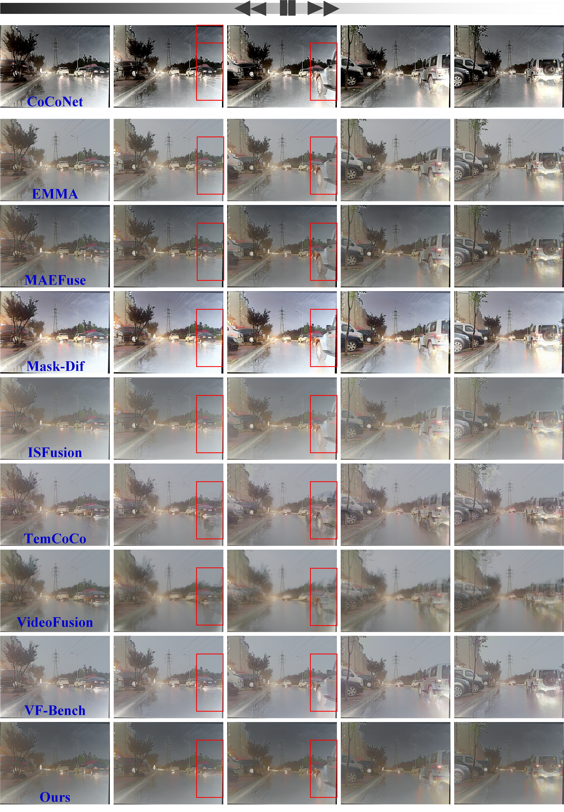

# UMVFuse
Toward Unified Multi-modal Image and Video Fusion via Dual-Teacher Prior Distillation

# Data Acquisition
The BraST2020 sequence dataset is available in [this link](https://www.med.upenn.edu/cbica/brats2020/data.html) 

The test sequence of M3FD is available in [this link](https://pan.baidu.com/s/1ih94fQQql0BxU1RhaZphTQ?pwd=QWER) (Note: We manually constructed eight short sequences from temporally continuous image pairs)

The Polarization dataset is available in [this link](http://www.ok.sc.e.titech.ac.jp/res/PolarDem/index.html) 

## Training

The Fusion Stage

```bash
torchrun --nproc_per_node=2 main_fusepro.py    --checkpoint /path/to/pretrained_encoder.pth   --dataset_config_path options/fusion.yml
```

## Inference

```bash
python test_fuse.py   --checkpoint /path/to/fusion_checkpoint.pth   --dataset_config_path options/fusion.yml   --save_images --fuse_vi_y_channel
```

## 🙌 UMVFuse

### Qualitative comparison of different methods in scenarios with abrupt changes in local content.

  

### Visualization of inter-frame difference maps of the fused results produced by different methods in scenarios with large-scale and non-uniform motion.

  
